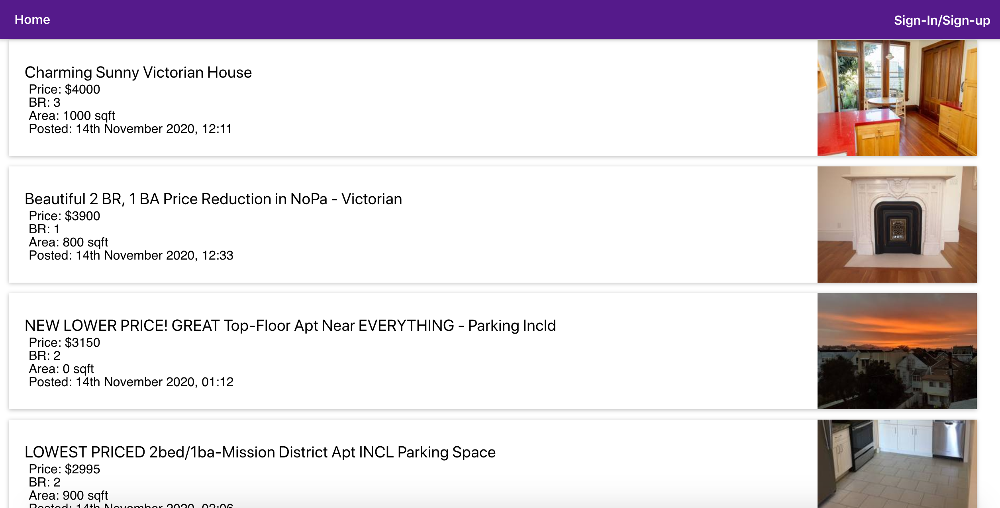
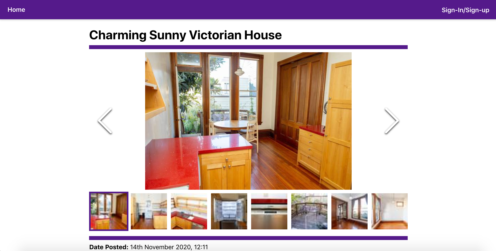
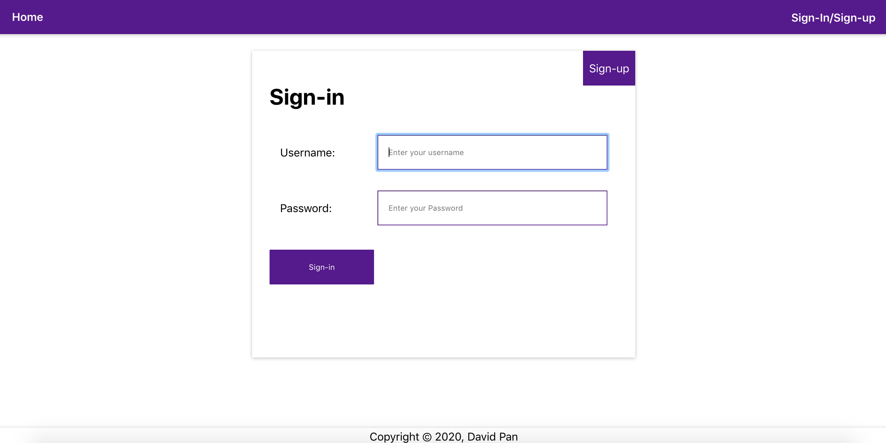

<!---
comment from Tiezhou: some part of the readme can be removed, and other things like screenshot can be added.
-->
# Proj4 -- Craigslist Post App

## Goal:

OK, so for the final project we will go with an individual project that implements the full stack. It should include everything that we cover in class. To ease your burden of choosing I'm choosing for you the topic.
You will be building an application that let's me explore a list of Craigslist postings (I'll give you the file). The app should let me see the listings in an orderly manner, it should let users filter and sort by different criteria and registered users annotate the postings.
You must implement full authentication with passport or similar, and add a creative element of your choice. You must get that creative component approved by me on #project, there cannot be repeated creative components. If you need ideas DM me.
Deadline is the day of the final exam.

Class link: https://johnguerra.co/classes/webDevelopment_fall_2020/

## Author:

- David Pan

## Deployed app:

Application is deployed on heroku: https://craigslistapts.herokuapp.com/

## Instructions to Build:

1. Clone the repository.
2. Navigate to repository folder in command line.
3. Run npm install to install dependencies.
4. Set the following ENV variables so the backend can functions property.
   - ENV (default value= localhost)
   - PORT (default value= 3000)
   - URI (no default value)
5. In command line type 'npm start:all' to start both the backend as well as frontend react.

- For only backend: 'npm run backend'
- For only frontend: 'npm run start-react'

6. In your web browser go to localhost:8080 to visit the site. (3000 for backend)

## Screenshots:

## Post page:

## Screenshot of login page:

## License

> You can check out the full license [here](/LICENSE)

This project is licensed under the terms of the **MIT** license.
